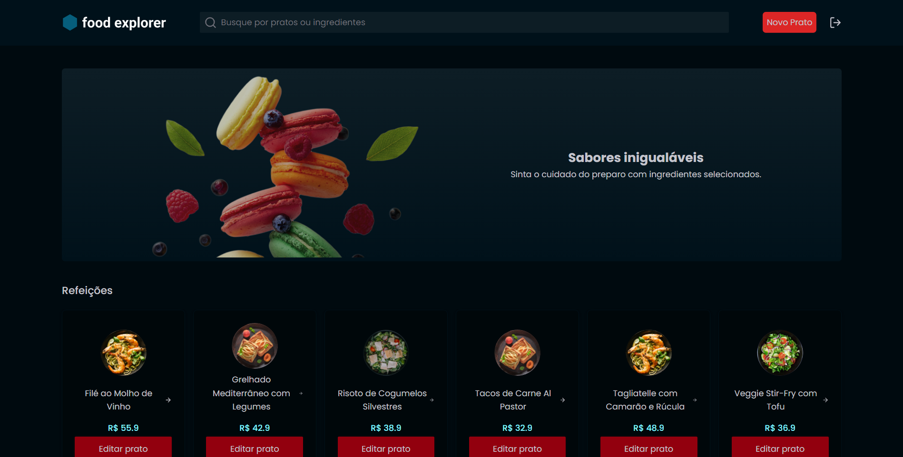

# FoodExplorer - Front End

In this repository you can acess the frontend code of the FoodExplorer project. It's a full stack project that consists in a restaurant website where you can list, add, remove and update your company dishes. You can set a title, a price, a description and some ingredients that will help your clients see your products and buy the dishes you cook. Feel free to use this project for your own purposes.

## ✨ Live Preview

You can access the live preview clicking [here]().

## Preview



## 🚀 How can I set up the frontend?

First of all, clone the project in your computer.

```bash
  git clone git@github.com:gustavogarciac/foodexplorer-frontend.git
```

---

### 💫 Running the frontend

```bash
  // Install necessary dependencies
  $ npm install

  //Run the server
  $ npm run dev

  // The terminal will show you the write url to acess the server, otherwise you can acess
  // http://localhost:5173/

  // Admin user data:
  $ email: admin@email.com
  $ password: admin@123

```

## 🚀 Technologies

- ReactJS
- NodeJS
- Vite
- TailwindCSS
- Axios
- React Router Dom
- JavaScript

## 💻 Copywright

Feel free to use this material to your own projects. Keep studying, we can change the world!
